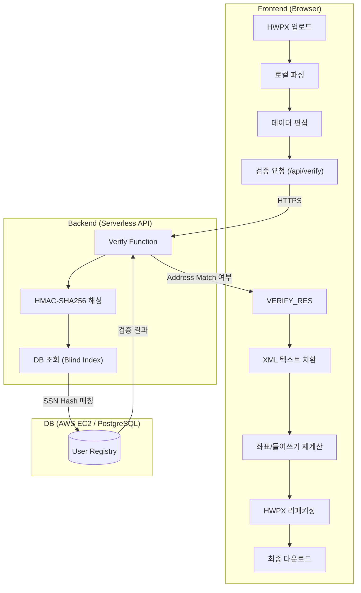

# HWPX 스마트 편집기 (해촉증명서)

Regex 기반 로컬 파싱을 통해 HWPX 문서를 분석하고, PostgreSQL 데이터베이스와 연동하여 실시간 검증을 제공하는 고속 문서 편집 도구입니다.

## 🚀 주요 기능

### 1. HWPX 처리 엔진

- **⚡ 고속 로컬 파싱**: Regex 기반 XML 파싱으로 외부 API 호출 없이 브라우저에서 즉시 데이터를 추출합니다.
- **🏗️ Advanced 레이아웃 엔진**:
  - **Hanging Indent**: 긴 주소 텍스트에 대해 자동으로 들여쓰기 좌표를 계산하여 가독성을 높입니다. (최대 너비 최적화 완료)
  - **Dynamic Shifting**: 내용이 길어질 경우 하단 단락들을 자동으로 밀어내어 겹침을 방지합니다.
- **🛡️ 원본 무결성**: OCF 표준 준수 및 속성 보호를 통해 '파일 손상' 없이 원본 서식을 완벽하게 유지합니다.
- **🎨 UI/UX Refinement**: Browser Native alert 대신 전용 커스텀 모달(Lucide 아이콘 기반)을 사용하여 사용자 경험을 고도화했습니다.
- **📂 직관적인 파일명**: 다운로드 시 `신청인성함_건강보험공단제출용해촉증명서.hwpx` 형식으로 자동 생성됩니다.

### 2. 백엔드 및 보안 (New)

- **☁️ Serverless Architecture**: Vercel Serverless Function을 통해 별도의 서버 구축 없이 백엔드 로직을 처리합니다.
- **🔒 데이터 보안**:
  - **SSN 암호화**: 주민등록번호는 `pgcrypto`를 사용하여 AES-256 (`pgp_sym_encrypt`) 방식으로 암호화되어 DB에 저장됩니다.
  - **Blind Index Searching**: 검색 시에는 복호화 없이 `HMAC-SHA256` 해시값(`ssn_hash`)만을 사용하여 매칭하므로, 검색 속도가 빠르고 보안성이 뛰어납니다.
  - **네트워크 보안**: 모든 데이터 전송은 HTTPS를 통해 암호화됩니다.

## 📋 시스템 아키텍처



## 🗄️ 데이터베이스 구조

### `hwpx_01.user_registry` (메인 테이블)

해촉증명서 발급 대상자의 기본 정보와 암호화된 개인정보를 관리합니다.

| 컬럼명 | 타입 | 설명 | 보안/특이사항 |
| :--- | :--- | :--- | :--- |
| `id` | SERIAL | 고유 식별자 | PRIMARY KEY |
| `manager` | TEXT | 담당자 | |
| `payment_date` | DATE | 지급년월일 | |
| `registrant_name` | TEXT | 신고소득자명 | **Index** (조회용) |
| **`ssn`** | **BYTEA** | 주민등록번호 | **AES-256 암호화** 저장 (`pgcrypto`) |
| **`ssn_hash`** | **TEXT** | 주민번호 해시 | **Blind Index** (HMAC-SHA256), **Index** |
| `contact` | TEXT | 연락처 | |
| `address` | TEXT | 거주주소 | |
| `promotion_name` | TEXT | 프로모션명 | |
| `blog_url` | TEXT | 블로그 URL | |
| `instagram_url` | TEXT | 인스타 URL | |
| `created_at` | TIMESTAMPTZ | 데이터 생성일 | DEFAULT NOW() |
| `updated_at` | TIMESTAMPTZ | 데이터 수정일 | DEFAULT NOW() |

> [!NOTE]
> 주민등록번호 원본(`ssn`)은 직접 조회하지 않으며, 검증 시에는 검색 인덱싱된 `ssn_hash`값과 사용자 이름(`registrant_name`)을 결합하여 매칭합니다.

## 📂 프로젝트 구조

```text
hwpx-back/
├── api/
│   └── verify.ts              # Vercel Serverless Function (DB 검증 로직)
├── services/
│   └── localParserService.ts  # HWPX 파싱 엔진
├── db_data/                   # DB 마이그레이션 스크립트 및 문서
├── App.tsx                    # 메인 UI 및 프론트엔드 로직
└── README.md                  # 프로젝트 문서
```

## ⚙️ 시작하기

### 1. 요구 사항

- **Node.js**: v18 이상 권장
- **Vercel CLI**: 서버리스 함수 및 로컬 환경 구동을 위해 필수
- **PostgreSQL**: 데이터 저장을 위한 DB 환경 (현재 AWS EC2에 구성됨)

### 2. 환경 및 의존성 설정

먼저 프로젝트를 로컬로 가져온 후 필요한 패키지를 설치하고, Vercel 계정 인증을 진행합니다.

```bash
# 1. 의존성 설치 (프로젝트 루트에서 실행)
npm install

# 2. Vercel CLI 전역 설치 (미설치 시)
npm install -g vercel

# 3. Vercel 계정 로그인 (로그인이 안 되어 있는 경우)
vercel login
```

### 3. 프로젝트 연결 및 환경 변수 동기화

로컬 환경에서 DB API를 호출하기 위해 Vercel 프로젝트와 연동하고 저장된 환경 변수를 가져옵니다.

```bash
# 4. Vercel 프로젝트 연결
# (최초 실행 시 'Set up and deploy?' 질문에 'Y' 후 기존 프로젝트 이름 선택)
vercel link

# 5. 환경 변수 동기화 (.env.local 생성)
vercel env pull .env.local
```

### 4. 로컬 실행

**API와 프론트엔드를 동시에 구동하려면 반드시 `vercel dev`를 사용해야 합니다.**

```bash
# 로컬 개발 서버 실행 (localhost:3000)
vercel dev
```

> **Note**: `npm run dev`는 프론트엔드 전용 서버이므로 `/api/verify` 호출 시 에러가 발생합니다. 반드시 Vercel CLI가 로컬 런타임을 에뮬레이션하는 `vercel dev`를 사용해 주세요.

## 🔑 환경 변수 목록

Vercel 대시보드(Environment Variables) 혹은 `.env` 파일에 기록되어야 하는 핵심 변수입니다:

- `DATABASE_URL`: PostgreSQL 인스턴스 접속 주소
- `DB_ENCRYPTION_KEY`: DB 데이터 암호화 및 해싱용 32자 비밀키

## ⚠️ 참고 사항

- 본 도구는 표준 HWPX 파일만 지원합니다. (.hwp 파일은 변환 후 사용)
- 로컬 개발 환경(`vercel dev`)에서는 DB 접속 시 네트워크 지연이 발생할 수 있으나, 배포 환경에서는 초고속으로 동작합니다.
