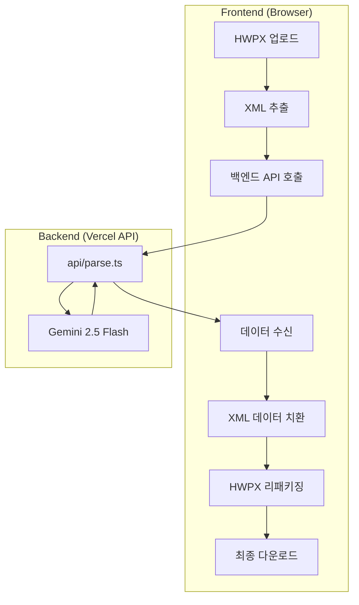

# HWPX AI 스마트 편집기 (해촉증명서)

Gemini AI를 활용하여 HWPX 문서를 분석하고, 데이터를 수정하여 다시 저장할 수 있는 지능형 문서 편집 도구입니다.

## 주요 기능

- **⚡ 고속 모드 (Latency Optimized)**: Gemini 2.5 Flash 모델을 기반으로 최적화된 데이터 추출 및 처리 속도를 제공합니다.
- **🛡️ 보안 강화**: Gemini API 호출을 백엔드(Vercel API)로 분리하여 API Key의 클라이언트 노출을 완벽히 차단했습니다.
- **🎯 정밀 XML 편집**: `fast-xml-parser`를 도입하여 XML 구조를 유지하며 필요한 데이터만 정밀하게 치환하는 고도화된 편집 기능을 제공합니다.
- **✨ 다이내믹 사용자 경험 (UX)**:
  - **실시간 진행 상황**: 로딩 중 4단계 실시간 상태 메시지 노출.
  - **시각적 로딩 바**: 분석 진행률을 시각적으로 보여주는 프로그레스 바 제공.
  - **애니메이션 효과**: Fade-in 및 Slide-in 효과를 통한 부드러운 화면 전환.
- **실시간 편집 및 재생성**: 추출된 데이터를 웹 UI에서 바로 수정하고, 원본 서식을 유지한 채 새로운 HWPX 파일로 다운로드할 수 있습니다.

## 🤖 AI 모델의 역할 (Gemini 2.5 Flash)

본 프로젝트에서 Gemini AI는 백엔드(Vercel API)를 통해 비정형 XML 데이터에서 정밀한 정보 추출(Information Extraction)을 수행합니다.

- **보안 강화**: API Key를 서버 사이드(`api/parse.ts`)에서 관리하여 클라이언트 노출을 원천 차단합니다.
- **비정형 데이터 구조화**: HWPX 내부의 복잡한 XML 텍스트에서 '해촉증명서' 서식에 해당하는 데이터만 선별적으로 추출합니다.
- **주요 필드 자동 맵핑**:
  - **개인 정보**: 신청인 성명, 주민등록번호, 주소지
  - **용역 정보**: 용역 기간, 용역 내용, 용도
  - **발행처 정보**: 업체명, 사업자번호, 업체 주소, 대표자 성명
  - **기타**: 증명서 발급일
- **구조화된 출력**: 추출된 데이터를 전용 JSON 스키마에 맞춰 정확하게 반환하여 프론트엔드 UI와 즉각 연동되도록 합니다.

## **Gemini 2.5 Flash 파싱 및 수정 절차**

이 섹션은 백엔드 API를 통해 Gemini 2.5 Flash 모델로 HWPX(내부 XML)를 파싱하고, 추출된 데이터를 문서에 반영(수정)하는 구체적 절차를 설명합니다.

- 1) HWPX -> XML 추출 (Client)
  - HWPX는 ZIP 기반 패키지입니다. 프론트엔드에서 `JSZip`을 사용하여 주요 XML(예: section1.xml)을 추출합니다.

- 1) 백엔드 API 호출 (Client -> Server)
  - 추출된 XML 텍스트를 `/api/parse` 엔드포인트로 전송합니다.

- 1) AI 모델 호출 (Server)
  - 서버 측에서 API Key를 사용하여 Gemini 모델을 호출합니다.
  - `responseMimeType: "application/json"` 및 `responseSchema`를 사용하여 정형화된 JSON 데이터를 응답받습니다.

- 1) 응답 반영 및 정밀 수정 (Client)
  - `fast-xml-parser`를 사용하여 XML을 JS 객체로 파싱합니다.
  - 재귀적 탐색을 통해 실제 텍스트 데이터 노드만 찾아 안전하게 치환하여 XML 구조 파손을 방지합니다.
  - 수정된 객체를 다시 XML로 빌드한 후 `JSZip`으로 패키징하여 새로운 `.hwpx` 파일로 제공합니다.



- 간단한 의사코드 예시:

## 📂 프로젝트 구조

```text
hwpx-back/
├── api/
│   └── parse.ts          # [Server] Gemini API 호출 핸들러 (Vercel API)
├── services/
│   └── geminiService.ts  # [Client] 백엔드 API 호출 로직
├── App.tsx               # 메인 화면 및 비즈니스 로직
├── types.ts              # 데이터 모델 및 타입 정의
├── vite.config.ts        # Vite 설정 및 프록시 설정
└── README.md             # 프로젝트 문서
```

## ⚙️ 시작하기

### 1. 요구 사항

- Node.js (Latest LTS)
- Google Gemini API Key

### 2. 설치 및 실행

```bash
# 의존성 설치
npm install

# .env.local 설정
# GEMINI_API_KEY=YOUR_API_KEY_HERE

# 로컬 개발 서버 실행
npm run dev
```

## ⚠️ 참고 사항

- 본 도구는 표준 HWPX 파일만 지원하며, 구형 바이너리 (.hwp) 파일은 지원하지 않습니다.
