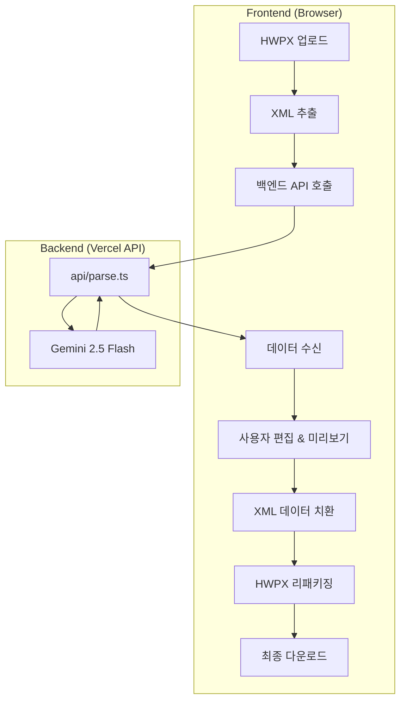

# HWPX AI 스마트 편집기 (해촉증명서)

Gemini AI를 활용하여 HWPX 문서를 분석하고, 데이터를 수정하여 다시 저장할 수 있는 지능형 문서 편집 도구입니다.

## 주요 기능

- **⚡ 고속 모드 (Latency Optimized)**: Gemini 2.5 Flash 모델을 기반으로 최적화된 데이터 추출 및 처리 속도를 제공합니다.
- **🖼️ PDF 스타일 인터랙티브 미리보고**: 실제 A4 용지 규격(ISO 216)을 웹에서 완벽히 재현하고, 화면 크기에 따라 지능적으로 크기가 조절되는 반응형 스케일링 엔진을 탑재했습니다.
- **🛡️ 보안 강화**: Gemini API 호출을 백엔드(Vercel 서버리스 함수)로 분리하여 API Key의 클라이언트 노출을 완벽히 차단했습니다.
- **🎯 원본 보존 정밀 편집**:
  - `fast-xml-parser`를 통한 구조적 치환으로 XML 구조 파손 방지.
  - **속성 보호**: 문서의 뼈대(ID, 스타일) 정보인 속성값은 유지하고 본문 텍스트만 정밀 치환.
  - `fast-xml-parser`를 통한 구조적 치환으로 XML 구조 파손 방지.
  - **속성 보호**: 문서의 뼈대(ID, 스타일) 정보인 속성값은 유지하고 본문 텍스트만 정밀 치환.
  - **공백 및 들여쓰기 완벽 보존**: 파서의 트림 기능을 비활성화하여 주소지 등의 미세한 들여쓰기 구조를 원본과 동일하게 유지합니다.
  - **데이터 타입 보호**: 숫자(주민번호 등)가 자동으로 Number 타입으로 변환되어 문서가 손상되는 것을 방지 (`parseTagValue: false`).
- **🎨 초정밀 미리보기 (Pixel-Perfect Preview)**:
  - **1:1 원본 UI 재현**: 타이틀(25pt), 본문(14pt) 등 HWPX 고유 스타일을 웹 환경(`Tailwind CSS + Grid`)에 완벽 이식.
  - **천연 정렬(Natural Align)**: 인위적인 `Justify` 대신 원본의 수동 띄어쓰기(`&nbsp;`) 패턴과 그리드 시스템을 결합하여 콜론(:) 위치까지 정밀 맟춤.
  - **멀티라인 처리**: 주소지 두 줄 표기 시 들여쓰기 줄맞춤(Indentation)까지 HWPX와 동일하게 구현.

- **✨ 다이내믹 사용자 경험 (UX)**:
  - **실시간 진행 상황**: 로딩 중 4단계 실시간 상태 메시지 노출.
  - **시각적 로딩 바**: 분석 진행률을 시각적으로 보여주는 프로그레스 바 제공.
  - **애니메이션 효과**: Fade-in 및 Slide-in 효과를 통한 부드러운 화면 전환.

## 🤖 AI 모델의 역할 (Gemini 2.5 Flash)

본 프로젝트에서 Gemini AI는 백엔드(Vercel API)를 통해 비정형 XML 데이터에서 정밀한 정보 추출(Information Extraction)을 수행합니다.

- **공식 SDK 적용**: `@google/generative-ai` 공식 패키지를 사용하여 런타임 안정성을 확보했습니다.
- **보안 강화**: API Key를 서버 사이드(`api/parse.ts`)에서 관리하여 클라이언트 노출을 원천 차단합니다.
- **비정형 데이터 구조화**: HWPX 내부의 복잡한 XML 텍스트에서 '해촉증명서' 서식에 해당하는 데이터만 선별적으로 추출합니다.
- **주요 필드 자동 맵핑**: 신청인(성명/주민번호/주소), 용역 정보(기간/내용/용도), 발행처 정보를 전용 JSON 스키마로 구조화합니다.

## **Gemini 2.5 Flash 파싱 및 수정 절차**

이 섹션은 백엔드 API를 통해 Gemini 2.5 Flash 모델로 HWPX(내부 XML)를 파싱하고, 추출된 데이터를 문서에 반영(수정)하는 구체적 절차를 설명합니다.

- **1) HWPX -> XML 추출 (Client)**
  - `JSZip`을 사용하여 HWPX 패키지 내의 주요 XML 세그먼트를 추출합니다.

- **2) 백엔드 API 호출 (Client -> Server)**
  - 공식 Gemini SDK가 탑재된 `/api/parse` 엔드포인트로 XML을 전송하여 안전한 환경에서 분석을 수행합니다.

- **3) 원본 보존 정밀 수정 로직 (Client)**
  - **구조 분석**: `XMLParser(trimValues: false, parseTagValue: false)`를 사용하여 원본의 미세 공백과 데이터 타입을 보존합니다.
  - **텍스트 치환**: 재귀적 탐색 중 **속성 키(@_)**를 제외한 본문 텍스트만 데이터 치환을 수행하여 레이아웃 무결성을 유지합니다.
  - **XML 빌드**: `XMLBuilder(format: false)`를 통해 원본의 줄바꿈과 공백 구조를 100% 보존합니다.
  - **선언부 복원**: 한글 프로그램 호환성을 위해 XML Declaration(`<?xml ... ?>`)과 CRLF 줄바꿈을 명시적으로 결합합니다.

- **4) 시각적 피드백 및 리패키징**
  - 추출된 데이터를 A4 규격의 고화질 미리보기에 실시간 동기화하여 시각적으로 확인합니다.
  - 수정 완료 시 `JSZip`을 통해 원본 HWPX 패키지 구조를 유지한 채 새로운 `.hwpx` 파일로 제공합니다.



- 간단한 의사코드 예시:

## 📂 프로젝트 구조

```text
hwpx-back/
├── api/
│   └── parse.ts          # [Server] Gemini API 호출 핸들러 (Vercel API)
├── services/
│   └── geminiService.ts  # [Client] 백엔드 API 호출 로직
├── App.tsx               # 메인 화면 및 비즈니스 로직
├── types.ts              # 데이터 모델 및 타입 정의
├── vite.config.ts        # Vite 설정 및 프록시 설정
└── README.md             # 프로젝트 문서
```

## ⚙️ 시작하기

### 1. 요구 사항

- Node.js (Latest LTS)
- Google Gemini API Key

### 2. 설치 및 실행

```bash
# 의존성 설치
npm install

# .env.local 설정
# GEMINI_API_KEY=YOUR_API_KEY_HERE

# 로컬 개발 서버 실행
npm run dev
```

## ⚠️ 참고 사항

- 본 도구는 표준 HWPX 파일만 지원하며, 구형 바이너리 (.hwp) 파일은 지원하지 않습니다.
